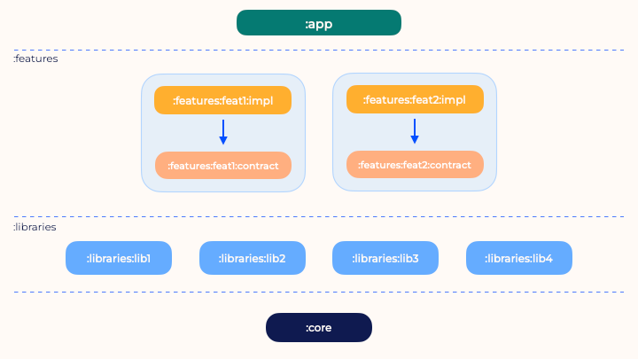

# Airalo Take Home Project

## Project Structure

The app uses a multi-modular project structure. There are 4 different types of modules:

- App
- Features
- Libraries
- Core

  

### Core:

A module that contains common code (e.g. some DTOs, models, utilities, etc) shared between 
all the modules. This module doesn't depend on other project modules.

### Libraries:

A library module contains small reusable components, for example, analytics, design system,
and testing utilities. This type of module can depend on other library modules or the core module.

### Features:

A feature module contains a specific feature, that could be user-facing or not. Every feature 
has a contract and an implementation module.

The contract module contains what a feature can do and how it can be launched. A contract module 
can depend on library modules or the core module.

The implementation module contains the implementation of the feature and it can depend on other
feature contract modules, library modules, or the core module.

### App

The app module is the Android Application, and it links all the modules together.
For that reason, it depends on all the other modules.

## Project Configuration

The project uses [Convention Plugins](https://docs.gradle.org/current/samples/sample_convention_plugins.html)
to set up different Gradle modules with the layering defined above.

## Navigation approach

Even if the project is fully Compose, every feature has its own Activity.
This is beneficial for legacy projects, that could still have a massive presence of Activities and 
Fragments. This way, the UI can be written (or rewritten) with Compose and the same navigation
system can be kept.

The navigation between different features can be done through the features contract. 
The contract can expose a method that starts the Activity, or it can expose the Intent to leave
freedom to the caller.

## Testing strategy

Besides regular Unit tests, the project contains some integration tests that use
Dependency Injection.

`ViewModel`s are tested with such integration tests. This means that `ViewModel`s must be instantiated
with their dependencies, and only the `RemoteDatSource`s are faked.
The dependency injection (DI) framework is responsible for instantiating the `ViewModel` under test
in test scenarios.

## Automations 🤖

The project is using [**detekt**](https://github.com/detekt/detekt) for formatting and static analysis.

There is also a GitHub Action, named [Code Checks](/.github/workflows/checks.yaml) that builds
and runs the `check` gradle task.

## Tech stack

- Networking: [Retrofit](https://github.com/square/retrofit)
- JSON Serialization: [Moshi](https://github.com/square/moshi)
- UI: [Jetpack Compose](https://developer.android.com/jetpack/compose)
- Testing: Junit 4, [Turbine](https://github.com/cashapp/turbine)
- Dependency Injection: [Koin](https://github.com/InsertKoinIO/koin)
- Image Loading: [Coil](https://github.com/coil-kt/coil)
- Logging: [Timber](https://github.com/JakeWharton/timber)
- Static Analysis: [Detekt](https://github.com/detekt/detekt)

## Tradeoffs

Due to timing constraints, some tradeoffs have been taken:

- The UseCases are not tested
- The [`country-packages`](features/country-packages) module is not entirely tested.
  The same testing approaches used in the [`country-chooser`](features/country-chooser) module 
  can be applied in this module.
- The exception returned from the APIs are not mapped to a domain model
- Only a generic error message is shown to the user.
- There are no UI tests. In a real scenario, there would be a
  [MockWebServer](https://github.com/square/okhttp/tree/master/mockwebserver) that takes JSON files
  and returns their content as API responses.
  To mitigate the absence of UI tests, the `ViewModel`s are tested with their real dependencies
  and there's a [test](app/src/test/java/com/prof18/airalo/DiModuleTest.kt) to verify the
  Dependency Injection graph.
- The language injected in the API calls header is always the same (`en`). In a real scenario, 
  the user's locale should be injected.
- The used currency is always Dollars. In a real scenario, the currency from the user's locale 
  or a currency code returned by the API should be used.
